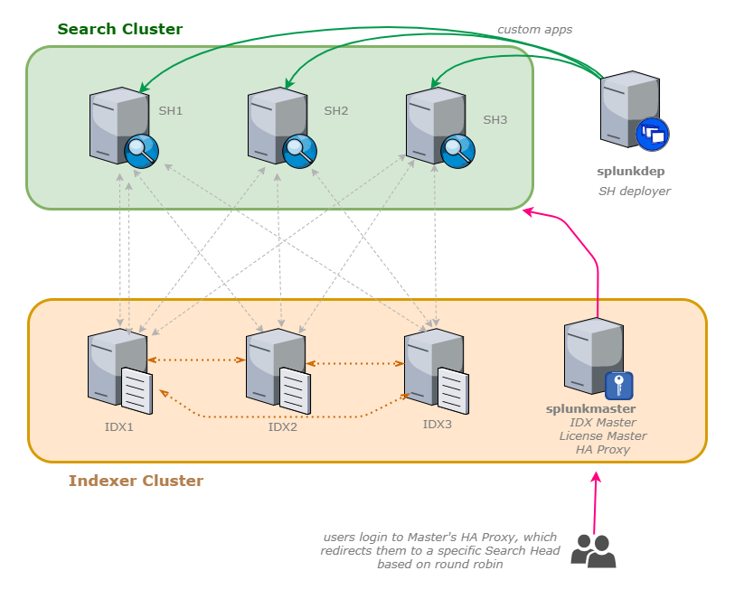

# Splunk Spaceballs
## Indexer Cluster & Search Head Cluster


*May the Shwartz be with you!*

### based on https://github.com/cuddlesec/ansible-splunk-simple
### also based on Bash-driven setup:   https://github.com/aplura/Vagrant_Splunk_Cluster

Tested on Centos 7 x64

These playbooks create custom Splunk app called Spaceballs that setup 2 Clusters (SH and Indexer) in addition to creating a Splunk Indexer Master and a Splunk SearchHead Deployer. 

The end result is this:


---
### Run in following order:
1. update Hosts file with Search Head and Cluster Master, update Deployer and Master IPs, 
   *Make sure your include FQDN hostnames, not short names, otherwise the setup wont work properly *

1. update config.yaml file for correct splunk version, passwords, labels, etc
  
1. run playbook to install master, indexers, deployer, search heads  
    ```bash 
    ansible-playbook -i hosts play_ludicrous_speed.yaml -v
    ```

Login to the Master server <master ip>:8000
check under Settings > Distributed Environment > INdexer clustering + Distributed search